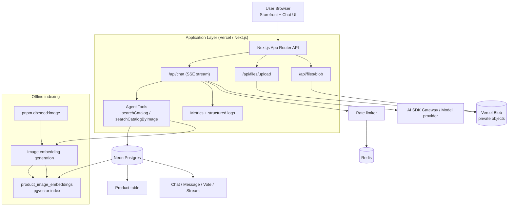

# Shopping Assistant (Palona Take-Home)

AI-powered shopping assistant with:
- text-based catalog recommendations,
- image-based similar-product search,
- strict catalog-only recommendation guarantees.

## Deliverables

- User-friendly storefront + chat interface.
- Documented agent API (included in this README, no separate API doc required).
- Code repository with setup, architecture, and deployment notes.

## Product Scope

### Core user journeys
- Ask for recommendations in natural language (`budget`, `category`, `style`).
- Upload an image and get visually similar products.
- Keep using assistant chat for non-shopping requests.

### Hard business rule
- The assistant may only return products that exist in internal catalog storage (`Product` table).

## System Architecture



## Tech Stack and Why

| Layer | Choice | Why this choice |
|---|---|---|
| Frontend + API | Next.js 16 (App Router), React 19, TypeScript | Fast iteration, one codebase for UI + API routes, strong DX for take-home scope. |
| Agent orchestration | Vercel AI SDK (`streamText`, tools, SSE) | Native streaming UX and tool-calling with minimal glue code. |
| Primary database | Neon Postgres + Drizzle ORM | Managed Postgres, SQL transparency, migration-friendly development. |
| Vector retrieval | `pgvector` inside the same Postgres | Minimal architecture: no separate vector service, easy JOIN with catalog. |
| File storage | Vercel Blob (private) | Simple upload pipeline and secure private object handling. |
| Blob access control | `/api/files/blob` proxy | Model/provider never gets storage credentials; controlled download path. |
| Rate limiting | Redis | Lightweight quota enforcement and production-friendly behavior. |
| Validation and safety | Zod + typed schemas | Request-level safety and predictable API contracts. |
| Testing | Playwright E2E (core scenarios) | Validates critical product flows end-to-end, including image-only submit and fallback behavior. |

## Key Design Decisions

### 1. Catalog-only recommendation guarantee
- Recommendation tools are the only source of product truth.
- Prompt + tool policy disallow invented products.
- Image and text retrieval both resolve to internal catalog rows.

### 2. Minimal online vector layer
- `Product` remains canonical business entity.
- `product_image_embeddings` is retrieval index only.
- Offline embedding script is idempotent (`upsert` by `product_id`).

### 3. Private image safety
- Uploads are private in Blob.
- Assistant uses proxied URLs from `/api/files/blob`.
- Prevents direct provider fetch against private storage origin.

### 4. Incremental implementation strategy
- Practical for take-home scope: no heavy multi-service retrieval stack.
- Clear phase-by-phase improvements with observable outcomes.

## Data Model (Relevant)

- `Product`: source of truth for catalog items.
- `product_image_embeddings`: `product_id`, `embedding`, `model`, `updated_at`.
- `Chat`, `Message_v2`, `Vote_v2`, `Stream`: chat lifecycle persistence.

Migration for vector index:
- `lib/db/migrations/0012_product_image_embeddings.sql`

## Agent API (Documented)

### Auth and access
- Session required for chat and upload endpoints.
- Bot traffic is rejected.
- Chat ownership is enforced (`chat.userId` must match current user).

### 1) `POST /api/chat`

Primary agent endpoint. Streams responses via SSE.

Request body:

```json
{
  "id": "chat-uuid",
  "message": {
    "id": "message-uuid",
    "role": "user",
    "parts": [
      { "type": "text", "text": "Recommend breathable running tees under $40" }
    ]
  },
  "selectedChatModel": "openai/gpt-4.1-mini",
  "selectedVisibilityType": "private"
}
```

Supported message part types:

```json
{ "type": "text", "text": "..." }
```

```json
{
  "type": "file",
  "mediaType": "image/jpeg",
  "name": "shoe.jpg",
  "url": "https://<blob-url>"
}
```

Behavior:
- Validates input with Zod.
- Normalizes file parts into safe text instructions with proxy URL.
- Uses tool-calling for non-reasoning models.
- For shopping intents, calls:
  - `searchCatalog` for text-based retrieval,
  - `searchCatalogByImage` for image-based retrieval.
- Persists chat messages to Postgres.

Response:
- `200` `text/event-stream` (SSE UI message stream).

Common error codes:
- `400 bad_request:api`
- `400 bad_request:activate_gateway`
- `401 unauthorized:chat`
- `403 forbidden:chat`
- `429 rate_limit:chat`
- `503 offline:chat`

### 2) `DELETE /api/chat?id=<chatId>`

Deletes a chat owned by current user.

Success:
- `200` with deleted chat payload.

Common failures:
- `400` missing `id`
- `401` unauthenticated
- `403` unauthorized ownership

### 3) `POST /api/files/upload`

Uploads image to private Vercel Blob storage.

Constraints:
- Auth required.
- Max size: `5 MB`.
- MIME types: `image/jpeg`, `image/png`.

Success sample:

```json
{
  "url": "https://<private-blob-url>",
  "downloadUrl": "https://<private-blob-url>?download=1",
  "pathname": "image-abc.jpeg",
  "contentType": "image/jpeg"
}
```

Failure sample:

```json
{ "error": "File size should be less than 5MB" }
```

### 4) `GET /api/files/blob?url=<blob-url>`

Server-side Blob proxy for image fetch/read.

Validation:
- `url` is required.
- URL host must match `*.blob.vercel-storage.com`.

Responses:
- `200` image stream with proper `content-type`.
- `400` missing/invalid URL or unsupported host.
- `404` blob not found.

### Tool contracts used by the agent

`searchCatalog` output (simplified):

```json
{
  "query": "running t-shirt",
  "total": 3,
  "products": [
    {
      "id": "tee-001",
      "name": "SwiftDry Performance T-Shirt",
      "category": "t-shirt",
      "price": 29,
      "currency": "USD",
      "imageUrl": "https://...",
      "reason": "Matches: running | Budget range any - $40",
      "ctaLabel": "View Product",
      "ctaUrl": "https://..."
    }
  ]
}
```

`searchCatalogByImage` output (simplified):

```json
{
  "imageUrl": "https://...",
  "embeddingModel": "text-embedding-3-small",
  "total": 3,
  "products": [
    {
      "id": "shoe-001",
      "name": "AeroRun Road Shoes",
      "similarity": 0.83,
      "reason": "Strong visual match"
    }
  ]
}
```

## Local Setup

### Prerequisites
- Node.js 20+
- pnpm 9+
- Postgres/Neon connection
- Vercel Blob store

### Install

```bash
pnpm install
```

### Environment (`.env.local`)

- `AUTH_SECRET`
- `POSTGRES_URL`
- `BLOB_READ_WRITE_TOKEN`
- `AI_GATEWAY_API_KEY` (required outside Vercel OIDC/Gateway-managed environments)
- `REDIS_URL` (recommended)
- `MAX_MESSAGES_PER_DAY`
- `IP_MAX_MESSAGES_PER_DAY`
- `IMAGE_SEARCH_DEBUG`

### Database bootstrap

```bash
pnpm db:migrate
pnpm db:seed
pnpm db:seed:image
```

### Run and build

```bash
pnpm dev
pnpm build
```

## Validation and Testing

- Build passes via `pnpm build` (includes migration + Next.js production build).
- Core scenarios validated:
  - text recommendation returns catalog items only,
  - image upload + retrieval returns catalog items only,
  - image-only submit works (no empty-text schema regression).
- Core E2E test file:
  - `tests/e2e/phase-c-core.test.ts`

## Deployment (Vercel)

Environment checklist:
- `AUTH_SECRET`
- `POSTGRES_URL`
- `BLOB_READ_WRITE_TOKEN`
- `AI_GATEWAY_API_KEY` (if required by model routing mode)
- `REDIS_URL`
- `MAX_MESSAGES_PER_DAY`
- `IP_MAX_MESSAGES_PER_DAY`

Additional references:
- Demo script: `docs/demo-script.md`
- Deployment notes: `docs/deployment-vercel.md`

## Limitations

- Retrieval is intentionally catalog-limited.
- Image match quality depends on embedding quality and source image quality.
- No advanced reranker/fusion layer yet.
- Observability is lightweight (request timing + structured logs).

## Roadmap

### Near term
- Better ranking signals (price fit + feedback features).
- Wider failure-path test coverage.
- Dashboard-ready metrics (latency percentiles and failure rates).

### Mid term
- Hybrid ranking (text + image fusion).
- Stronger synonym and category normalization.
- Prompt/tool policy A/B tests for recommendation quality.
